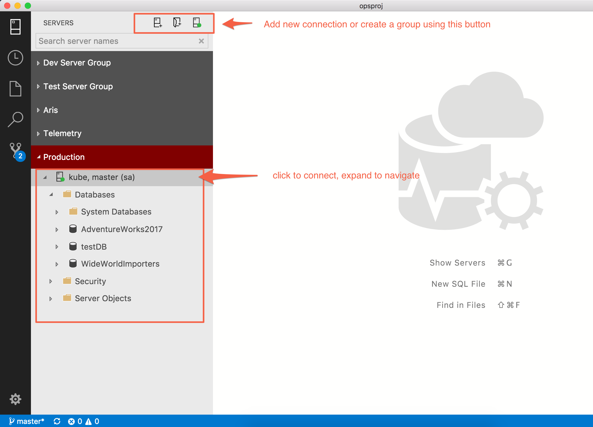
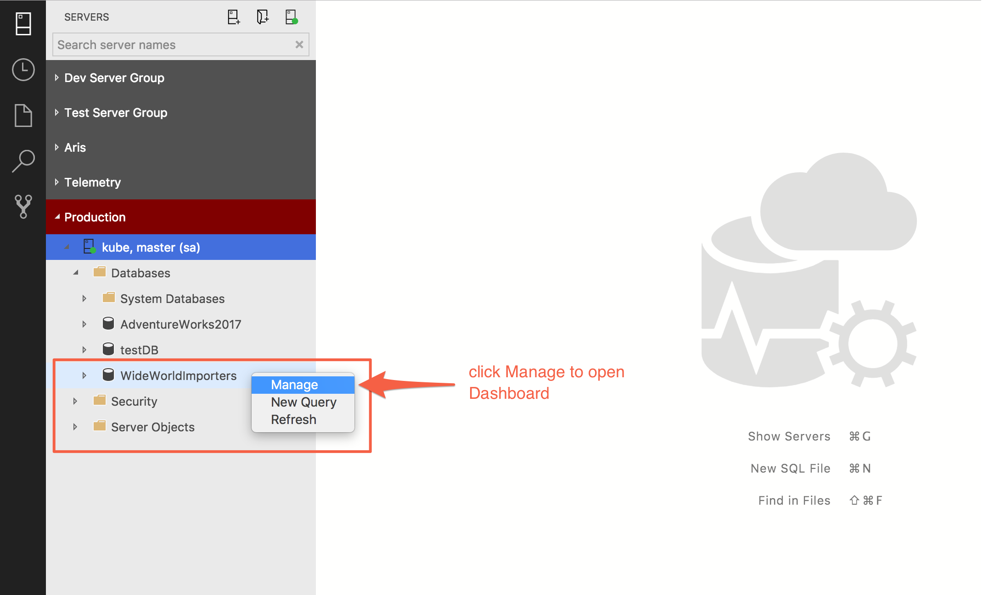
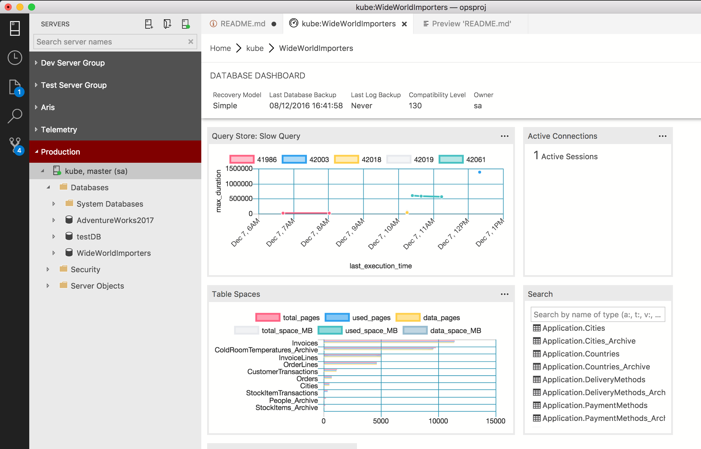
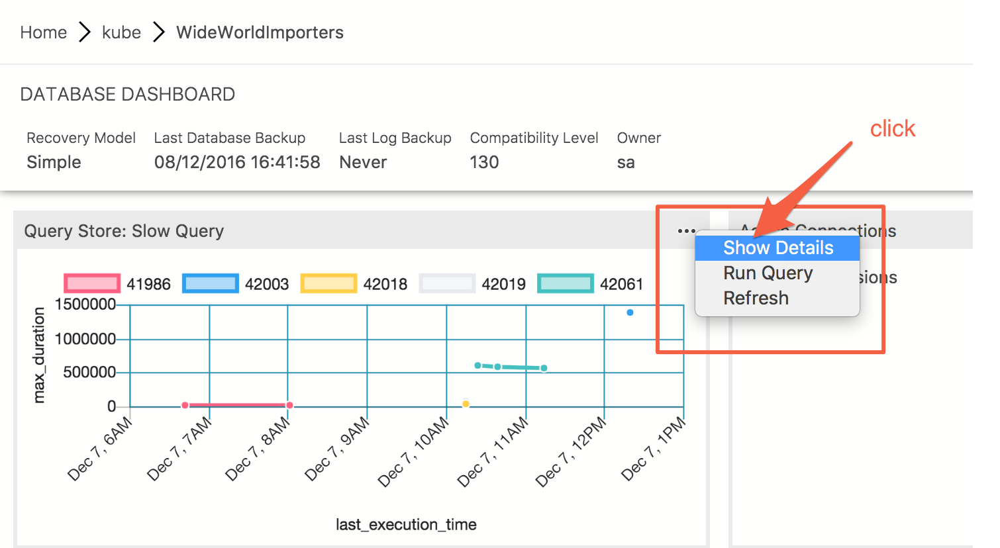
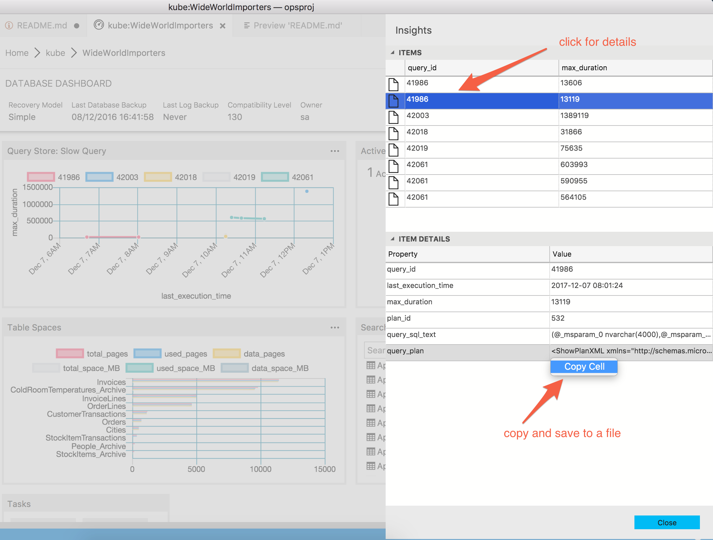
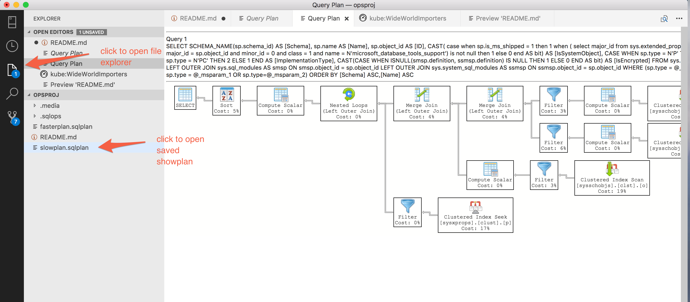
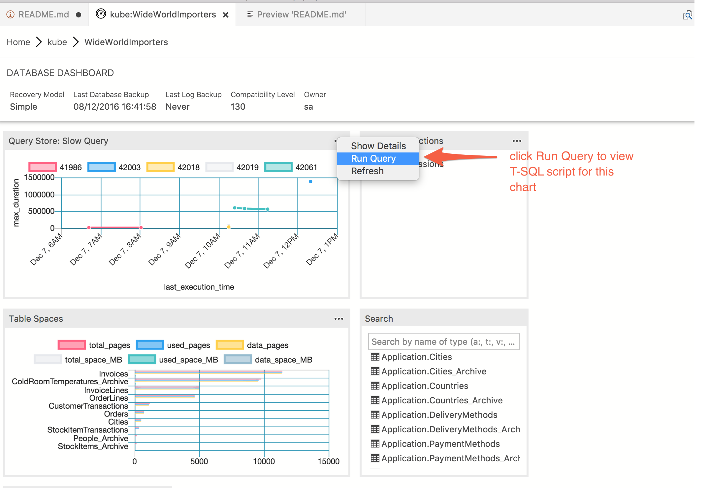
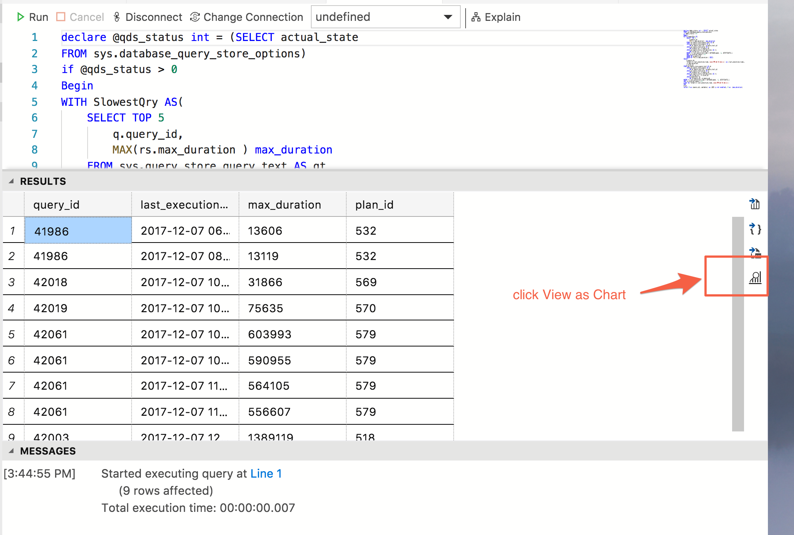
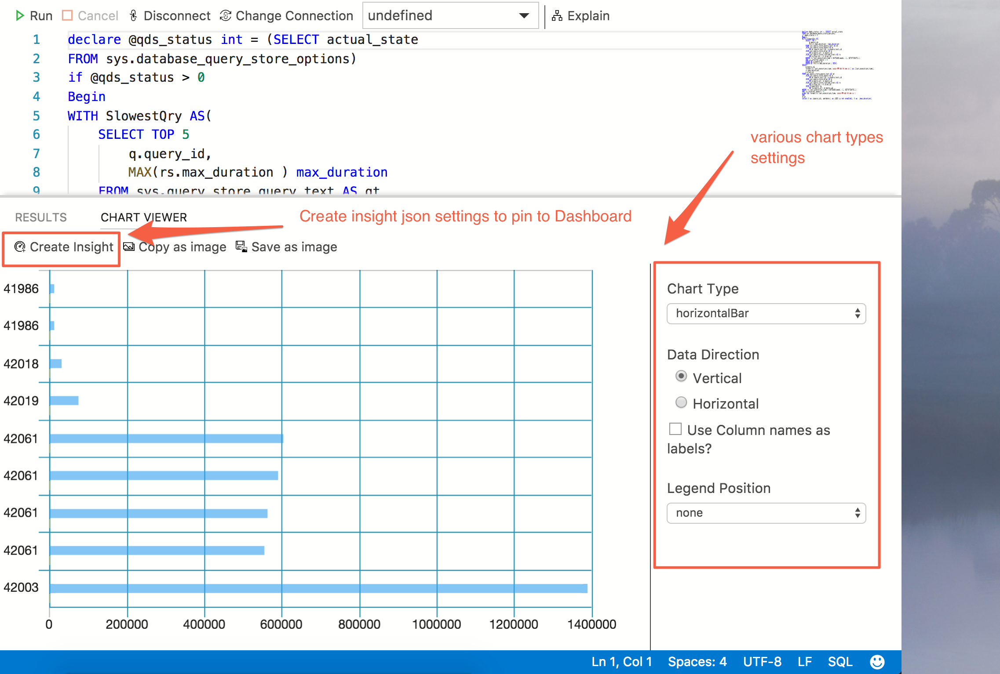

# Demo instruction

## Preparation

### Download SQL Operations Studio

1. Download SQL Ops Studio

Platform | Link
-- | --
Windows | https://go.microsoft.com/fwlink/?linkid=862648
macOS | https://go.microsoft.com/fwlink/?linkid=862647
Linux | https://go.microsoft.com/fwlink/?linkid=862646

2. For macOS, double click to unzip the file.

3. Double-click to start SQL Ops Studio. 

Go to SQL Ops Studio [download page](https://aka.ms/sqlopsstudio) for more specific instructions.


### Download database

1. Run following command to download WideWorldImporters backup file.

   ```bash
   wget https://github.com/Microsoft/sql-server-samples/releases/download/wide-world-importers-v1.0/WideWorldImporters-Full.bak

   ```

2. Restore Wide World Importers database to your SQL Server.


## Git clone demo project

1. Run following command to clone **opsproj** repo.

   ```bash

   git clone https://github.com/erickangMSFT/opsproj.git

   ```

## Demo

### Start ops studio and make a connection to SQL Server.
1. Start SQL Ops Studio.

2. Open **opsproj** folder by pressing ```CMD + O``` and choose the folder.

3. Using Object Explorer (labeled as Servers), create a new connection to your demo SQL Srever instance.

4. Connect to the demo instance.

   


### Open Manage Dashboard from Object Explorer

5. Expand Ojbect Explorer, Databases folder.

6. On Wide World Importers database, open context menu by clicking right-mouse-button.

7. Select ```Manage``` to open Dashboard.

   

### Manage with Insights


#### View insight chart
8. Dashboard shows 3 insight widgets. ```Query Data Store: Slow Query```, ```Active Connections```, ```Table Space Usage```.

   


9. On QDS: Slow Query widget, click ```...``` on the widget to bring up context menu.

#### View insight details
10. To view the inishgt details, click ```Show Details``` menu. It opens up QDS plan history.

   

11. Click any ```Item (query plan history)``` to view the detail properties from QDS.

12. A property value can be copied and saved in a file by using ```Copy Cell```.

   

#### View query plan from QDS

13. We have saved ```fasterplan.sqlplan``` and ```slowplan.sqlplan``` in ```opsproj``` folder.

14. Double click slowplan.sqlplan file. It will open Showplan viewer.

   


### Dashboard is fully customizable with your own T-SQL script

15. On the QDS: Slow Query widget, click ```...``` to bring up the context menu. Click ```Run Query``` to show the T-SQL script that is feeding data to the insight graph.
    
    User can bring in any T-SQL query that returns name and numeric values as the query result. Then SQL Ops Studio can render it into various graphical charts and pin it to Dashboard.

    

16. To view chart from any query result, click ```View as Chart``` icon. It will render out a chart automatically.
    

17. To pin the chart to Dashboard, click ```Create Insight``` button. It will produce JSON settings that user can copy and paste into ```User Settings```.
   

--end of demo--
 


